  
  
  
  
   
  

## 🧭 From pixel to packet

I'm an IT student at **Asia Pacific University** and a **Frontend Developer at BarqSec**. I like working across the whole stack of a system — the interface people click, the services behind it, the network underneath, and the data (or the evidence) it leaves behind. I use AI-assisted development carefully: it speeds up debugging and refactoring, but decisions stay grounded in how the system actually behaves.

| 🎨 Build the interface | ⚙️ Run the systems | 🔍 Read the data |
| :-- | :-- | :-- |
|  |  |  |
| React · Tailwind · Vite · cross-browser debugging | Linux services (DNS, mail, SSH, Apache) · Cisco Packet Tracer · FastAPI | R · SQL · Volatility · Autopsy · Git-based teamwork |

## 🚀 Featured work

<table>
  <tr>
    <td width="50%" valign="top">
      <h3>🗓️ <a href="https://github.com/Youssefghazy/appointment-booking">appointment-booking</a></h3>
      A small single-service booking system — no accounts, <b>no double-booking</b>. Built spec-first with the GitHub Spec Kit workflow.  
      <code>FastAPI</code> <code>SQLite</code> <code>Spec Kit</code>
    </td>
    <td width="50%" valign="top">
      <h3>🌐 <a href="https://youssefghazy.vercel.app/projects/neurobyte-wan-network-design">NeuroByte WAN Design</a></h3>
      A 4-office enterprise WAN with full-mesh links, VLSM addressing, DHCP/DNS and NAT — designed and configured in Cisco Packet Tracer.  
      <code>Cisco</code> <code>VLSM</code> <code>DHCP/DNS</code> <code>NAT</code>
    </td>
  </tr>
  <tr>
    <td width="50%" valign="top">
      <h3>🐧 <a href="https://youssefghazy.vercel.app/projects/enterprise-linux-network-services">Enterprise Linux Services</a></h3>
      A lab DNS server with forward + reverse zones and a full mail server (Postfix + Dovecot), tested and troubleshot end to end.  
      <code>Linux</code> <code>BIND</code> <code>Postfix</code> <code>Dovecot</code>
    </td>
    <td width="50%" valign="top">
      <h3>🔍 <a href="https://youssefghazy.vercel.app/projects/memory-acquisition-digital-forensics">Memory &amp; Disk Forensics</a></h3>
      Investigated a compromised Windows 10 VM: RAM capture first, then memory + disk analysis to recover indicators of compromise.  
      <code>Volatility</code> <code>Autopsy</code> <code>MRC</code>
    </td>
  </tr>
  <tr>
    <td width="50%" valign="top">
      <h3>🏥 <a href="https://youssefghazy.vercel.app/projects/hospital-management-system">Hospital Management System</a></h3>
      A 5-person Python CLI system with role-based modules. I owned the full receptionist workflow — registration, scheduling, check-in/out.  
      <code>Python</code> <code>OOP</code> <code>File storage</code>
    </td>
    <td width="50%" valign="top">
      <h3>📈 <a href="https://youssefghazy.vercel.app/projects/network-intrusion-analytics-with-r">Network Intrusion Analytics</a></h3>
      Explored labelled attack traffic in R to see how packet volume per session separates normal from malicious flows.  
      <code>R</code> <code>tidyverse</code> <code>ggplot2</code>
    </td>
  </tr>
</table>

<a href="https://youssefghazy.vercel.app/#projects"><b>→ See all 12 case studies on my portfolio</b></a>

## 🏆 Highlights

- 🥇 **UMHackathon 2026 — 4th Runner-Up** · AI Systems & Agentic Workflow Automation (Universiti Malaya × PEKOM)
- 🤖 **AI Marathon 2026** · APU Artificial Intelligence Club
- 🐧 **Red Hat System Administration I (RH124)** · ☁️ **AWS — Developing Generative AI Solutions**
- 🧮 **Peer Leader, Mathematics** at APU
- 📜 **16 certifications** across networking, systems and data · 🌍 Arabic · English · French

## 📊 Activity

  
  

<picture>
  <source media="(prefers-color-scheme: dark)" srcset="profile/snake-dark.svg" />
  <source media="(prefers-color-scheme: light)" srcset="profile/snake-light.svg" />
  
</picture>

  
<b>🤝 Want to work together?</b> (click)

   
  I'm <b>open to internships and collaborations</b> across software, networks and security.
  The fastest way to reach me is <a href="mailto:youssef.ahmed.said.ghazy@gmail.com">email</a> or
  <a href="https://www.linkedin.com/in/youssef-ghazy-468364328/">LinkedIn</a>.

